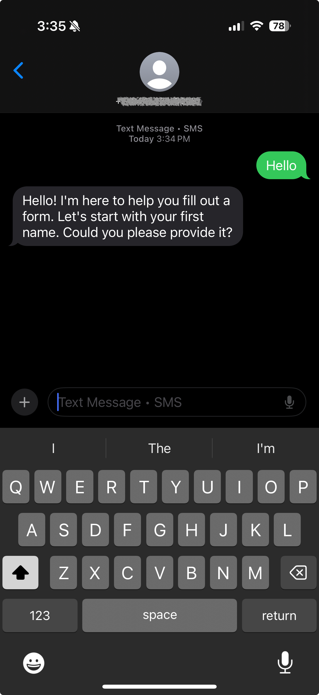

# SMS Receiver API for Azure Communication Services

This application provides an API endpoint to receive SMS events from Azure Communication Services, such as delivery reports and incoming messages, and a mobile web interface for ID photo uploads.



## Features

- FastAPI endpoint to receive webhook notifications from Azure Communication Services
- AI-powered responses to incoming SMS messages using Azure OpenAI
- Conversation history management for maintaining context across SMS exchanges
- Mobile-friendly web interface for users to upload ID photos

## Setup instructions

### Prerequisites

- Python 3.13 or higher
- An Azure account with Azure Communication Services configured
- Azure Communication Services connection string or managed identity credentials
- Azure Communication Services phone number with SMS capabilities. 
- Azure OpenAI service configured

### 1. Environment Variables

Set up the following environment variables:

```bash
# If using connection string authentication
export AZURE_COMMUNICATION_SERVICE_CONNECTION_STRING="your_connection_string"

# If using managed identity
export AZURE_COMMUNICATION_SERVICE_ENDPOINT="https://your-acs-resource.communication.azure.com"

# Azure OpenAI configuration
export AZURE_OPENAI_ENDPOINT="https://your-openai-resource.openai.azure.com/"
export AZURE_OPENAI_KEY="your_openai_api_key"

# Your Azure Communication Services phone number
export PHONE_NUMBER="+1234567890"
```


### 2. Run server in your local developer environment

```bash
# Run the FastAPI server
uv run fastapi dev
```

### 3. Create & host dev tunnel

For local development, you can use Azure Dev Tunnels to expose your local server to the internet:

```bash
# First, install the Azure CLI if you haven't already
# Then login to Azure
az login

# Create a tunnel (one-time setup)
devtunnel create --allow-anonymous

# Start the tunnel and forward to your local FastAPI server
devtunnel port create -p 8000
devtunnel host
```

Take note of the public dev tunnel URL as you'll need it in the proceeding webhook configuration step. The URL will be in the format: `https://<tunnel-id>-<port>.<region>.devtunnels.ms`


Navigate to your dev tunnel via the URL to ensure it's running correctly. 


### 4. Configuring Azure Communication Services Webhook

To receive SMS events in your API, you need to set up an Event Grid subscription in Azure:

1. Go to your Azure Communication Services resource in the Azure portal
2. Click on "Events" in the left navigation
3. Click "Event Subscriptions" and then "Add Event Subscription"
4. Configure the subscription:
   - Name: Give it a descriptive name like "SMSWebhook"
   - Event Schema: Event Grid Schema
   - Filter to Event Types: Select "SMS Received" and "SMS Delivery Report Received"
   - Endpoint Type: Select "Web Hook"
   - Endpoint: Enter your API URL by taking the dev tunnel URL from the preceeding step and appending the path `/api/sms/webhook` ex: `https://abcdef-8000.devtunnels.ms/api/sms/webhook`

5. Click "Create" to create the event subscription

The app should now be running. You can now use your mobile device to interact with the app via SMS. 

## SMS Response with Azure OpenAI

This application uses Azure OpenAI to automatically respond to incoming SMS messages with AI-generated responses. When an SMS is received:

1. The message is processed by the webhook endpoint
2. Azure OpenAI generates an appropriate response
3. A reply SMS is sent back to the original sender

Make sure your Azure OpenAI service is properly configured with a deployment of a model like GPT-4.


## API Endpoints

- `GET /`: Health check endpoint
- `POST /api/sms/webhook`: Webhook endpoint for receiving SMS events from Azure Communication Services

## Development

To run in development mode with hot reloading:

```bash
uvicorn main:app --reload
```

## Handling Incoming SMS Events

When an SMS event is received, it will be logged and processed in a background task. The application supports two event formats from Azure Event Grid:

1. Single event objects
2. Arrays of event objects (batch delivery)

### Event Structure

Azure Event Grid delivers events in the following structure:

```json
{
  "id": "unique-event-id",
  "eventType": "Microsoft.Communication.SMSReceived",
  "subject": "/phonenumbers/+1234567890",
  "data": {
    "from": "+11234567890",
    "message": "Hello world",
    "to": "+10987654321",
    "receivedTimestamp": "2023-01-01T00:00:00Z"
  },
  "eventTime": "2023-01-01T00:00:00Z",
  "topic": "/subscriptions/{subscription-id}/resourceGroups/{resource-group}/providers/Microsoft.Communication/communicationServices/{communication-service}",
  "dataVersion": "1.0"
}
```

For batch delivery, the events will be in an array:

```json
[
  {
    "id": "event-id-1",
    "eventType": "Microsoft.Communication.SMSReceived",
    "data": {...}
  },
  {
    "id": "event-id-2",
    "eventType": "Microsoft.Communication.SMSDeliveryReportReceived",
    "data": {...}
  }
]
```

The application handles both formats automatically.


## TODO: 
- Add function call for when the form is complete when all the data for the fields is correctly supplied.
- Add a simple website to enable users to upload their photo ID
